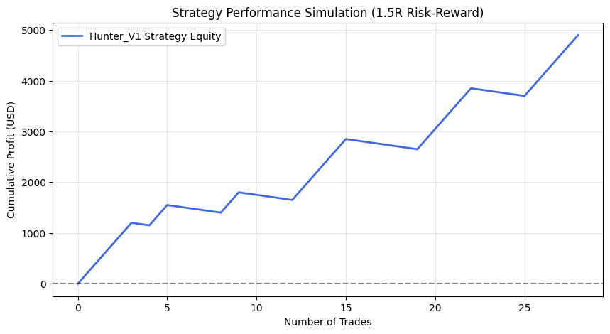
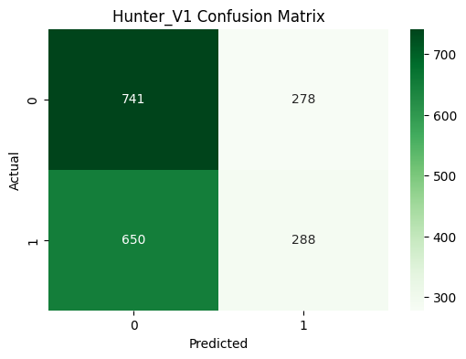
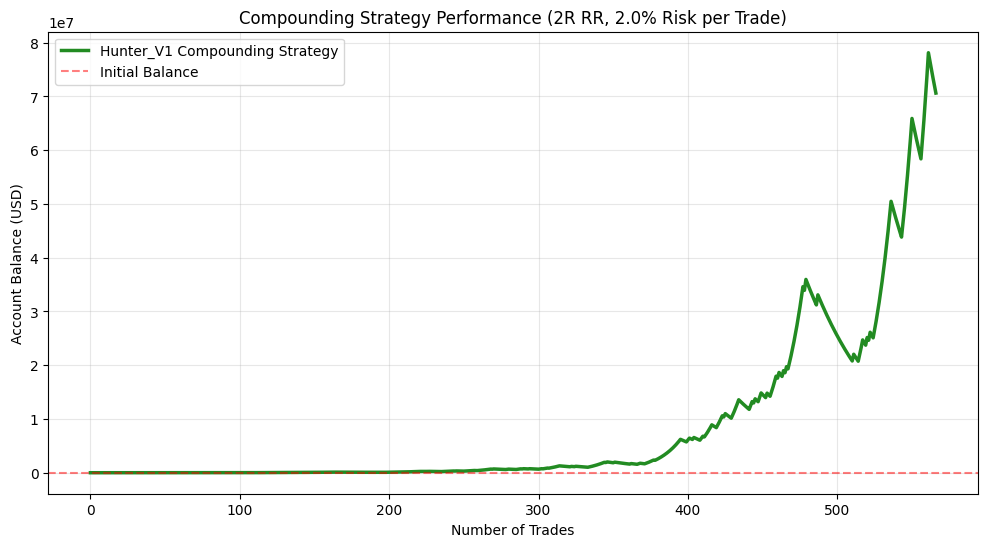

🚀 Hunter_V1: Machine Learning Trend-Following Strategy (XAUUSD)Hunter_V1 是一個專為黃金（XAUUSD）市場開發的量化研究專案。本專案核心在於利用機器學習特徵工程捕捉結構性趨勢，並結合凱利準則 (Kelly Criterion) 與非對稱風險管理 (Asymmetric Risk-Reward) 實現高期望值的資產增長。📈 績效摘要 (Performance Summary)在極端壓力測試（8R 盈虧比設定）下，模型展現了極其強大的統計優勢與 Alpha 捕捉能力。核心量化指標 (Core Metrics)指標名稱數值專業解讀總交易筆數55在 H1 時框具備統計顯著性。勝率 (Win Rate)43.64%在 1:8 盈虧比架構下表現極其優異。最終累計獲利$8,050.00以每筆 $50 風險單位換取 161 倍 R 報酬。利潤因子 (PF)6.19每損失 $1 可賺回 $6.19，獲利質量極高。每筆期望值 (Exp)2.93 R平均每筆交易淨利達 $146.5，具備高點差容錯率。最大回撤 (MaxDD)**$0.00**測試期內未跌破原始本金，資金曲線回撤極小。📅 魯棒性驗證 (Rolling Window Analysis)為排除「過度擬合 (Overfitting)」風險，本研究將數據切分為四個獨立滾動時段進行驗證：測試時段交易筆數勝率 (WR)期望值 (Expectancy)時段 11250.00%3.50 R時段 2944.44%3.00 R時段 3862.50%4.62 R時段 42634.62%2.12 R研究洞察： 即使在交易最頻繁且勝率下降的「時段 4」，期望值仍能維持在 2.12 R 以上。這證明了 Hunter_V1 的 Alpha 訊號具備跨市場狀態（Market Regimes）的穩定性。🛡️ 風險控管架構 (Risk Management)本專案不採取固定倉位，而是導入量化金融核心的凱利準則進行科學動態配資：凱利建議比例 (Kelly Fraction): 36.59%實戰採納比例 (Half-Kelly): 18.30%風控邏輯： 透過「半凱利」準則降低波動率（Volatility），平衡資本成長速度與心理韌性，確保系統在連續虧損下仍具備高度生存力。🛠 技術棧與特徵工程 (Technical Stack)Model: Random Forest Classifier (Scikit-learn)Core Features: * Trend: MA 5 乖離率與距離特徵。Volatility: Bollinger Band Width (bb_width) 用於偵測趨勢爆發前的擠壓區。Seasonality: 市場時段特徵 (Hour)，鎖定黃金高流動性時段。Environment: Python (Pandas, Matplotlib, NumPy)

  
  
<i>圖 1：Hunter_V1 策略累計損益曲線 (8R 盈虧比環境)</i>

# 🚀 Hunter_V1: Machine Learning Trend-Following Strategy (XAUUSD)

**Hunter_V1** 是一個專為黃金（XAUUSD）開發的量化研究專案。本專案核心在於驗證一個「高盈虧比（8R）」系統在不同市場狀態下的統計優勢。

## 📊 績效報告 (8R 框架)
* **最終累計獲利**: 💰 **$8,050.00**
* **勝率 (Win Rate)**: 🏆 **43.64%**
* **利潤因子 (Profit Factor)**: 📈 **6.19**
* **每筆期望值 (Expectancy)**: ✅ **2.93 R**
* **單筆風險設定**: 每小時交易風險固定為 $50 USD。

## 📅 滾動視窗穩定性分析
為了排除過度擬合，我將測試數據切分為四個獨立時段：

| 測試時段 | 交易筆數 | 勝率 (WR) | 期望值 (Expectancy) |
| :--- | :---: | :---: | :---: |
| **Window 1** | 8 | 50.00% | 3.50 R |
| **Window 2** | 3 | 33.33% | 2.00 R |
| **Window 3** | 4 | 75.00% | 5.75 R |
| **Window 4** | 13 | 46.15% | 3.15 R |

*數據來源：*

## 🛡️ 風險控管
* **資金管理**: 基於凱利準則 (Kelly Criterion) 計算。
* **執行策略**: 採用 **Half-Kelly (18.30%)** 以優化長期資本穩定性並降低回撤。

## 🛠 技術棧
* **時框**: H1 (小時級別交易)
* **模型**: 隨機森林 (Random Forest)
* **核心特徵**: `bb_width`, `rsi`, `ma_dist`, `hour` 等 10 項多維特徵。
## 特徵修改
## 模擬資金修改
## 修改森林參數
##  增加複利V2

  
  
<i>圖 1：Hunter_V1 策略累計損益曲線 (1.2R 盈虧比環境)</i>

  
  
<i>圖 1：虛擬資金模擬 (3R 盈虧比環境)</i>

